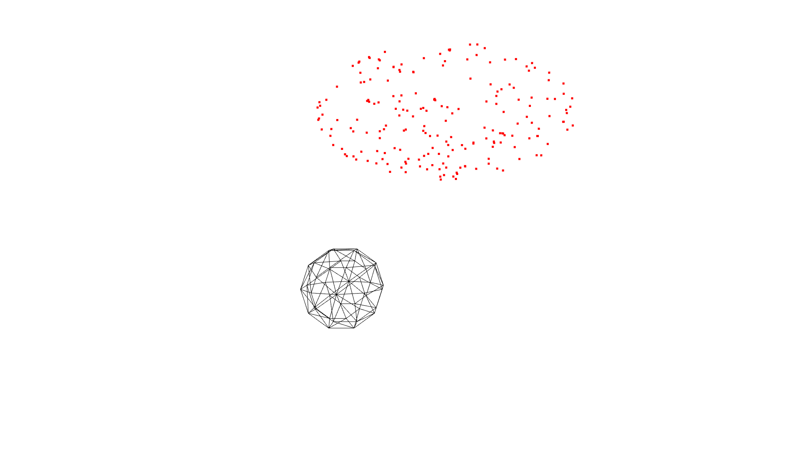

# Fit Mesh to Point Cloud

The idea is motivated from http://awf.fitzgibbon.ie/cvpr16_tutorial

## Code
The code is implemented in `C++`.

### Requirements
- [Eigen](http://eigen.tuxfamily.org/index.php?title=Main_Page)
- [Open3D](http://www.open3d.org/)
- [OpenSubdiv](http://graphics.pixar.com/opensubdiv/docs/intro.html)
- [OpenMP](https://www.openmp.org/)


## Usage

#### Compilation
```bash
cmake -S . -B build -DCMAKE_BUILD_TYPE=Release
cmake --build build/
```

#### Execution
```bash
./build/fit_sphere path/to/params_gt.json path/to/params_init.json [path/to/log/dir]
```

## Result
